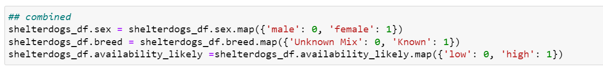
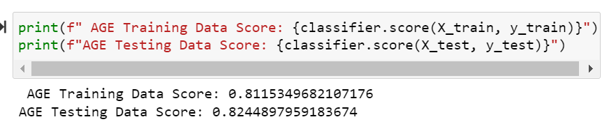
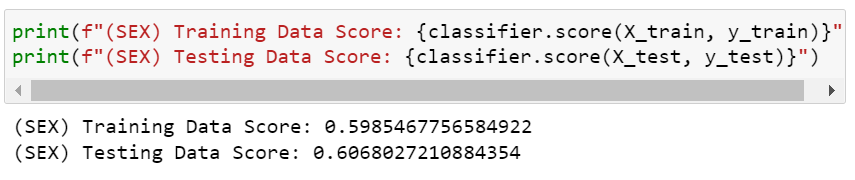
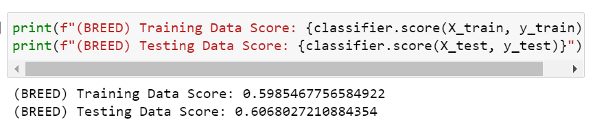
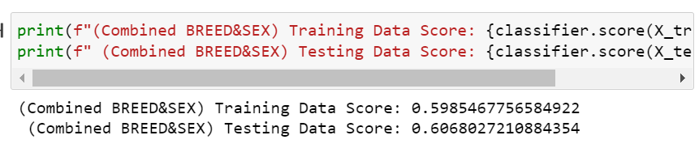
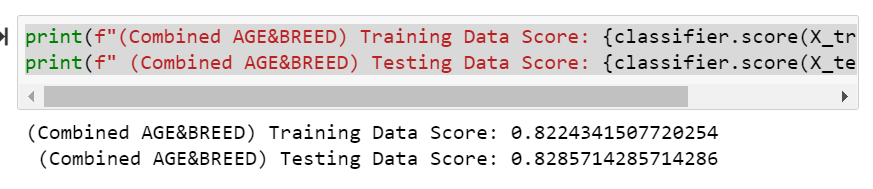
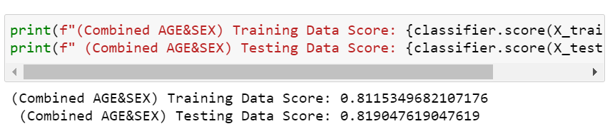
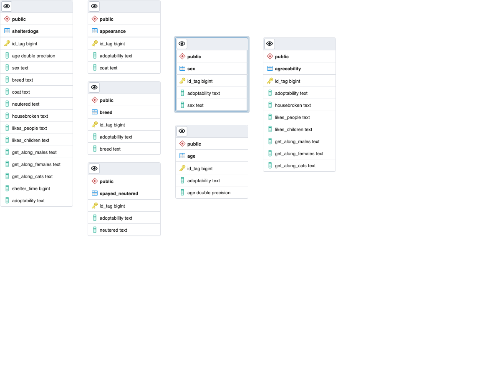

# Rutgers_Final_Project
## Project Overview
The topic we chose to analyze was 2019 data on Shelter Dogs availble for adoption in 2019. As dog lovers and rescue dog owners, we are interested in understanding the demographics of a dog shelter and what factors of the dogs personality or appearance could effect their likelyhood of getting adopted quickly. Since our data file does not show whether or not dog was adopted, we will be going off the data of how long the dog has been in the shelter from (data pulled Dec 12, 2019).

### Questions to Answer
- When prospective adopters stumble upon our website, we want them to be able to see the likelihood the dog is available based on certain criterias they are looking for in their forever friend. By using machine learning, we were able to determine the availability of the dog matching the adopters desires.
- Does the age of a dog influence the likelihood of them being adopted? Are puppies more likely to be adopted than senior dogs or vice versa?
-Does the dog’s gender influence the chances of being adopted? Which gender is more desirable?
- Does the dogs breed weigh heavily on the decision to adopt? Are Aggressive breeds/ unknown shelter mixes less likely to be adopted than known/desired breeds?

In our analysis, we hope to uncover some patterns within the demographics of the dogs at the shelter. Questions we are looking into are as follows–
- Do shelters mainly consist of older dogs or are there younger puppies available as well?
- Which gender makes up majority of available dogs?
- Are there any purebred dogs available for adoption or are most dogs unknown mixes?

## Presentation
Check out our presentation [here](https://docs.google.com/presentation/d/1pDOwgm4KDFHsqqZ5XA-lx-JEhnzCCqGH-2m1Bs0F4_8/edit#slide=id.p)

## Resources
The data is a compilation of information on 2,937 dogs who were available for adoption on December 12, 2019. Data points include dogs' names, breed, coat, age, sex, the date they were found, and some characteristics of their personalities.

Data Source: [Kaggle](https://www.kaggle.com/datasets/jmolitoris/adoptable-dogs)

- [ShelterDogs.csv](https://www.kaggle.com/datasets/jmolitoris/adoptable-dogs?select=ShelterDogs.csv)

## Group communication protocols
Working within a group of 2 had made the communication & execution of this project rather seamless. We have a shared google document as well as communication via slack.
[Team's Shared Document](https://docs.google.com/document/d/1KF-XNCNdnlLSpv6ixOsE8ZxQ-XxDwV9jrcZoqkKc6S8/edit) 
Since there are only 2 of us, we have been working together through most steps, but if we had to classify ourselves into roles we would be as follows:

**Team Responsibilties**

***Natalie*** - Square & Circle\
***Annie*** - Triangle & X

## Machine Learning Model & Data Analysis
### Logistic Regression
We concluded that the best machine learning model for our analysis would be a logistic regression. Because this data set provides all of the data and we were looking to see the likelihood of being adopted, a logistic regression was a perfect fit.
### Data Preprocessing and Feature Engineering
- When cleaning the data, we uncovered there were several null variables in columns such as neutered, breed and all of the characteristic categories. It is not uncommon for an animal shelter to not know the dog’s breed or characteristics since the animals can be found in various situations. Therefore, using .fillna(), we adjusted these columns to reflect no/unknown rather than NaN. This allows us to continue with our analysis; by adjusted breed to unknown we are able to categorize dogs as either having their breed known or unknowns; and assuming that if the characteristic is unknown, it is better to assume the answer is no.
- After adjusting the null variables, first step in our process was to determine the likelihood the dog is going to be available for adoption. After calculating the number of days the dog has been in the shelter, we determined that if a dog has been there for longer than 1800 days (5 years) it will be available. On the contrary, if the dog has been there for less than 5 years, we concluded that the availability will be lower than that of an older dog.
- Since we are using a Logistic Regression, we had to reformulate our datapoints into binary variables. Our main focus here was on age, sex, breed and availability.  

- From here, we were ready to move on to our machine learning model.

### Training and testing sets
#### Overall Analysis
For our general analysis, we assigned the data to X and y values where a dog's availability was the y value and all other variables were part of the X value. After training the model, we found that there was 0.8286 accuracy. Meaning, that the model at present is able to correctly predict a dog's likelihood of being adopted 82.9% of the time.

#### Analysis on Age only
For our analysis on age, we assigned the data to X and y values where a dog's availability was the y value and the X value was Age. After training the model, we found that there was 0.824 accuracy. Meaning, that the model at present is able to correctly predict a dog's likelihood of being adopted 82.4% of the time.

#### Analysis on Sex only
For our analysis on sex only, we assigned the data to X and y values where a dog's availability was the y value and the X value was Sex. After training the model, we found that there was 0.6068 accuracy. Meaning, that the model at present is able to correctly predict a dog's likelihood of being adopted 60.7% of the time.

#### Analysis on Breed only
For our analysis on breed only, we assigned the data to X and y values where a dog's availability was the y value and the X value was Breed. After training the model, we found that there was 0.6067 accuracy. Meaning, that the model at present is able to correctly predict a dog's likelihood of being adopted 60.7% of the time.

#### Analysis on Breed & Sex only
For our analysis on sex & breed only, we assigned the data to X and y values where a dog's availability was the y value and the X values were Breed&  Sex. After training the model, we found that there was 0.6068 accuracy. Meaning, that the model at present is able to correctly predict a dog's likelihood of being adopted 60.7% of the time.

#### Analysis on Age & Breed only
For our analysis on age & breed only, we assigned the data to X and y values where a dog's availability was the y value and the X values were Breed & Age. After training the model, we found that there was 0.8286 accuracy. Meaning, that the model at present is able to correctly predict a dog's likelihood of being adopted 82.9% of the time.

#### Analysis on Age & Sex only
For our analysis on age & sex only, we assigned the data to X and y values where a dog's availability was the y value and the X values were Sex & Age. After training the model, we found that there was 0.8190 accuracy. Meaning, that the model at present is able to correctly predict a dog's likelihood of being adopted 81.9% of the time.

## Database Integration
- Our dataset transformation can be further described on our [main branch](https://github.com/nataliecagno/Rutgers_Final_Project)

### Database
We used SQL to store our data and create tables for our desired breakout groups. 

For more information--[visit here](https://github.com/nataliecagno/Rutgers_Final_Project/tree/Annie)

## Dashboard
Using Tableau and HTML, we plan to create an interactive dashboard with plenty of visualizations on the demographics of the shelter dogs avaialble for adoption. We plan to make this user friendly where potentially adopters can enter certain characteristics such as age, gender, breed, etc. and it will tell them the likelihood the dog is still avaialble for adoption. 
