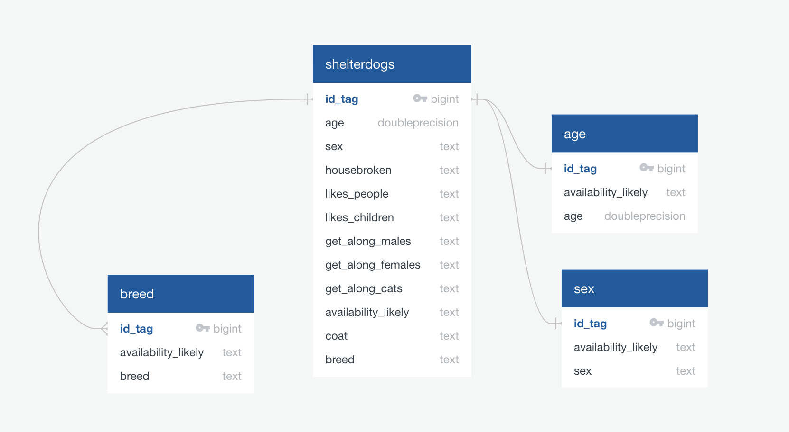
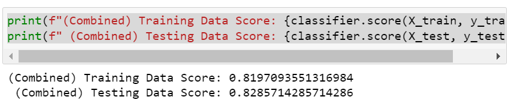
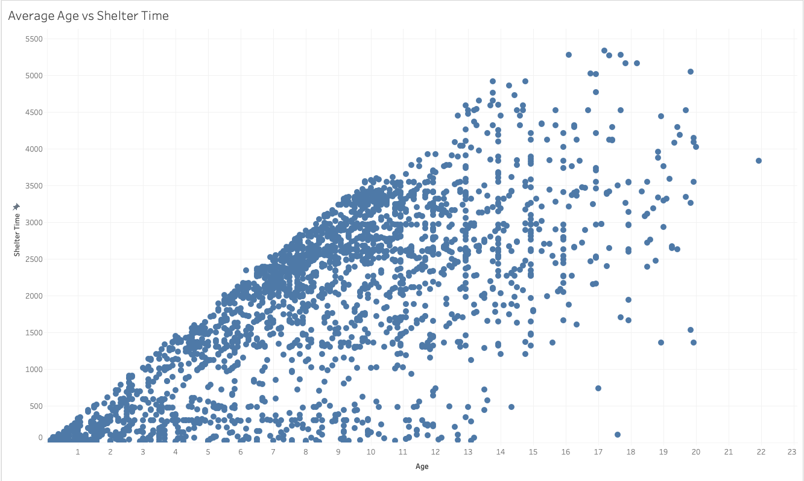

# Rutgers_Final_Project
## Project Overview
The topic we chose to analyze was 2019 data on Shelter Dogs availble for adoption in 2019. As dog lovers and rescue dog owners, we are interested in understanding the demographics of a dog shelter and what factors of the dogs personality or appearance could effect their likelyhood of getting adopted quickly. Since our data file does not show whether or not dog was adopted, we will be going off the data of how long the dog has been in the shelter from (data pulled Dec 12, 2019). Our end goal is to create a website for the shelter to showcase their dogs who are available for adoption. This will allow prospective adopters to determine if they dog they are looking for is still available to be adopted.

### Questions to Answer
When prospective adopters stumble upon our website, we want them to be able to see the likelihood the dog is available based on certain criterias they are looking for in their forever friend. By using machine learning, we were able to determine the availability of the dog matching the adopters desires.
- Does the age of a dog influence the likelihood of them being adopted? Are puppies more likely to be adopted than senior dogs or vice versa?
- Does the dog’s gender influence the chances of being adopted? Which gender is more desirable?
- Does the dogs breed weigh heavily on the decision to adopt? Are Aggressive breeds/ unknown shelter mixes less likely to be adopted than known/desired breeds?

In our analysis, we hope to uncover some patterns within the demographics of the dogs at the shelter. Questions we are looking into are as follows–
- Do shelters mainly consist of older dogs or are there younger puppies available as well?
- Which gender makes up majority of available dogs?
- Are there any purebred dogs available for adoption or are most dogs unknown mixes?

## Resources
The data is a compilation of information on 2,937 dogs who were available for adoption on December 12, 2019. Data points include dogs' names, breed, coat, age, sex, the date they were found, and some characteristics of their personalities.

Data Source: [Kaggle](https://www.kaggle.com/datasets/jmolitoris/adoptable-dogs)

- [ShelterDogs.csv](https://www.kaggle.com/datasets/jmolitoris/adoptable-dogs?select=ShelterDogs.csv)

## Database Integration
- Our dataset contains a lot of vital information, such as ID, Name, Breed, Age, Sex, Date Found, Adoptable From, Posted, Color, Coat, size, Neutered and other characteristics about dog. Like most data sets, it also included a lot of data points that do not impact our analysis. Columns we considered less value were Name, Keep In and Posted. These variables did not add any value to our analysis and were therefore removed.
- One variable we noticed would be an interesting datapoint was the time the dog has spent in the shelter. This information can be found by taking the “adoptable from” date subtracted from the date the data was pulled, which was 12/12/2019. We stored this data in a variable titled shelter_time. From here, we determined that if a dog had spent longer than 1825 days in the shelter (5 years) their likelihood of being adopted was low. This new information was stored in a new variable, adoptability, and shelter_time was removed from our dataset.
- When cleaning the data, we uncovered there were several null variables in columns such as neutered, breed and all of the characteristic categories. It is not uncommon for an animal shelter to not know the dog’s breed or characteristics since the animals can be found in various situations. Therefore, using .fillna(), we adjusted these columns to reflect no/unknown rather than NaN. This allows us to continue with our analysis; by adjusted bree to unknown we are able to categorize dogs as either having their breed known or unknowns; and assuming that if the characteristic is unknown, it is better to assume the answer is no.

### Database
Using sqlalchemy, we were able to connect our pandas library with pgAdmin store our data and create tables for our desired breakout groups.\

 **More Details**\
 

## Machine Learning Model & Data Analysis
### Machine Learning Model 
- We concluded that the best machine learning model for our analysis would be a logistic regression. Because this data set provides all of the data and we were looking to see the likelihood of being adopted, a logistic regression was a perfect fit.
- The first step in our process was to determine the likelihood the dog is going to be available for adoption. After calculating the number of days the dog has been in the shelter, we determined that if a dog has been there for longer than 1800 days (5 years) it will be available. On the contrary, if the dog has been their for less than 5 years, we concluded that the availability will be lower than that of an older dog. 
- Then we assigned the data to X and y values where a dog's availability was the y value and all other variables were part of the X value.
- After training the model, we found that there was 0.8286 accuracy. Meaning, that the model at present is able to correctly predict a dog's likelihood of being adopted 82.9% of the time.

**For more details on how we furthered our machine learning analysis**\

### Data Analysis
In our analysis we were interested in looking at two sides of the data set - average shelter time and overall shelter distribution at the time of the data pull.
We were interested in assessing how much age has an influence over adoption. To do this, we compared average shelter time in days to age. The following was the result:

**For a detailed data analysis answering more questions originally posed,**

 
## Presentation
Check out our presentation [here](https://docs.google.com/presentation/d/1pDOwgm4KDFHsqqZ5XA-lx-JEhnzCCqGH-2m1Bs0F4_8/edit#slide=id.p)

## Dashboard
Using HTML and Heroku, we have deployed an interactive website that allows potential adopters to check if their desired dog is available for adoption. By entering in an age, breed and gender, the site will tell you if the dog is avaialble for adoption or not.
View our page\

## Conclusion
Adopting a dog requires a lot of consideration on the part of the owner. While some dog characteristics have perceived influence over likelihood of being adopted, after the analysis one stood out as being a clear factor: age. 
Other influential factors include: getting along with cats and being a male.
The average life expectancy for dogs is 10-13 years (albeit longer for some smaller breeds). The longer they spend in a shelter, the odds go down they will find a forever home. Help give these friends a chance at a happy life, adopt don’t shop! Or, perhaps consider fostering a shelter dog… every bit counts!

